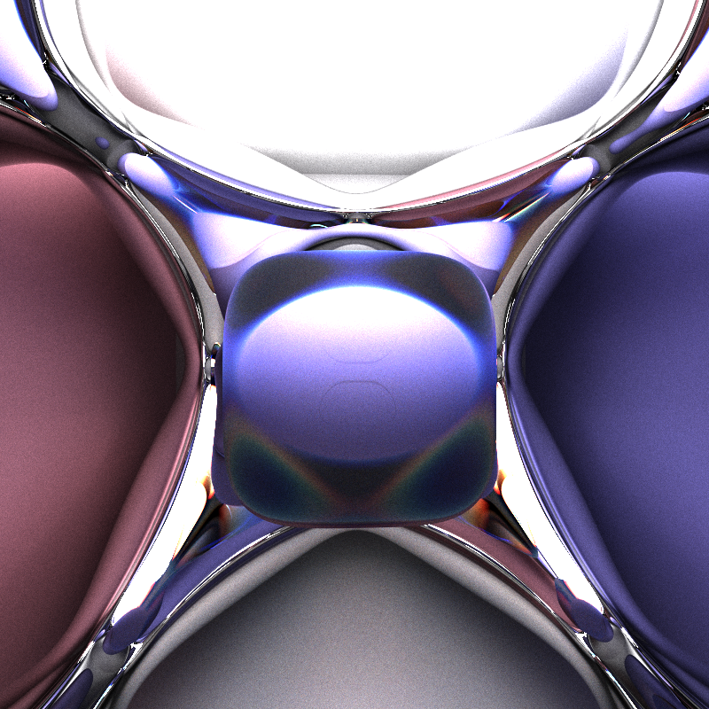
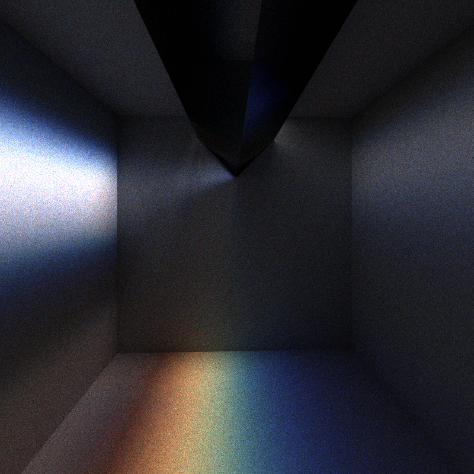
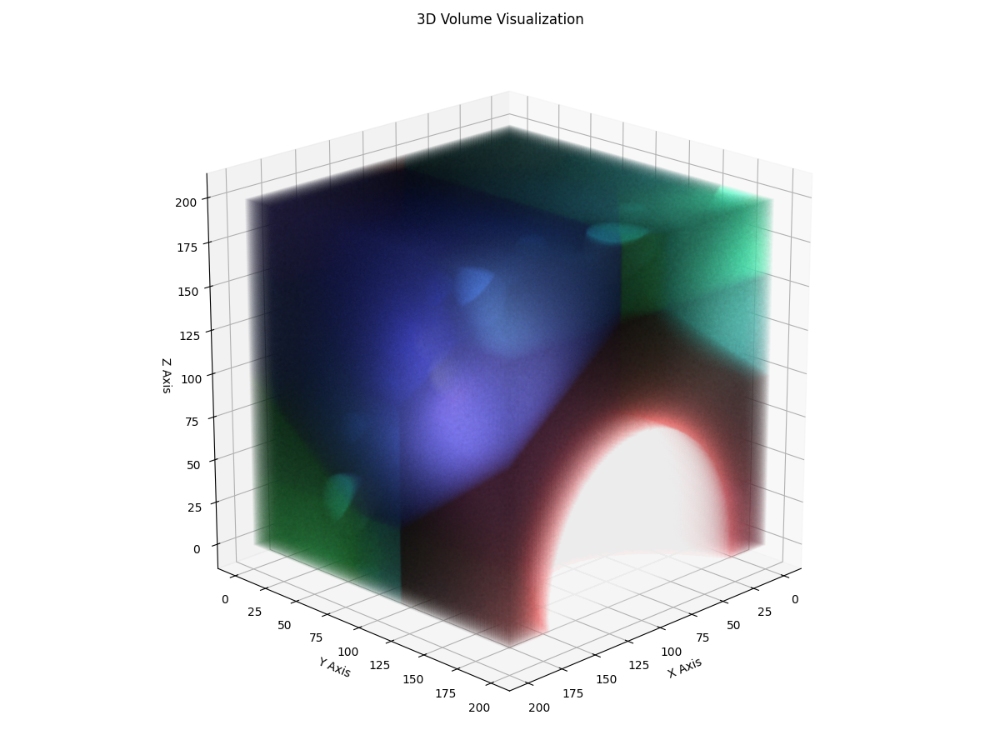

# Ray Tracing

[TOC]

## 🌈 Introduction

A high-performance, physically-accurate ray tracing engine for optical simulation and photorealistic rendering. Simulate light propagation, reflection, refraction, and complex optical phenomena with scientific precision.

### 🔥 Showcase

***Complex scenario, Texture, STL model file***: 


***Fourth-order & Quadratic polynomial surface***:



***Chromatic dispersion***: 



***Multi-Dimension | 4D (Testing)***: 



###  ✨ Featured Capabilities

The system implements a physically-based ray tracing algorithm that simulates the behavior of light rays as they interact with objects in a 3D environment. It supports various geometric shapes, material properties, and optical effects including dispersion and energy conservation.

- Implement advanced visualization of optical phenomena through ray tracing rendering, supporting topological spaces with arbitrary dimensions and curvature to ensure accurate simulation of light propagation.
- Enable intersection detection and computation between rays and a variety of geometric shapes with customizable material properties, including refractive indices.
- Provide support for reading STL and texture files, and exporting images in .png, .jpg, and .ppm formats. Facilitate scene setup via user-defined construction scripts.
- Deliver a specialized research tool tailored for optical engineers, researchers, and educators to support theoretical and applied studies in optics.

## 🏗️ System Architecture


The `RayTracing` module simulates light rays interacting with objects in a 3D environment to generate realistic images. The rendering process employs Monte Carlo ray tracing with these steps:

- **System Initializatio**: First load scene script (JSON format) from command line arguments or default path and initial the scene, which contain the camera and the object. Parse the script and build materials and objects. For all objects on the scene, we build the object tree base on the objects to organizes objects in a 3D scene into a binary tree structure. Create camera and set viewing parameters.
- **Image Partitioning**: Divide image pixels across available threads
- **Ray Generation**: For each pixel, generate primary rays from camera
- **Ray Tracing**: For each ray which generated by camera, recursively traces a ray through the scene, simulating interactions with objects, and calculates its resulting color. 
  - **Find intersection**. Find the nearest intersection of the ray with objects in the scene. Check if recursion depth exceeds `MaxRayLevel`. If true, return the color of black. If find, then calculate the normal vector at the intersection point and align it to face the incoming ray. Recur with the new ray until termination or depth limit. Computes the nearest intersection between a ray and the objects in the tree: (1) If the node is a leaf (contains an object), compute the intersection with that object. (2) If the node is not a leaf, test if the ray intersects the node's bounding box. (3) Recursively check child nodes for intersections, keeping track of the nearest valid intersection. (4) Finally, Returns the distance to the nearest intersection and updates the pointer to the intersected object.
  - **Dielectric surface propagation**. Propagate the ray based on material properties of corresponding object, and update the ray and its color.
  - Generate secondary rays (reflected, refracted) up to depth limit
  - Accumulate color contributions along ray path
- **Sample Accumulation & Result Output**: Combine multiple samples per pixel for anti-aliasing, and normalize pixel values by the number of samples. Write ray's result and final color values to the corresponding pixel in the image base on its coordinates.


### Core Components

#### Scene

Scene contains all objects and cameras, and is the basic unit for rendering.

#### Ray

Ray is the most fundamental concept in the system, containing the following attributes:
- Origin: Starting coordinates
- Direction: Propagation direction
- Color: Color value
- WaveLength: Wavelength (for dispersion calculations)
- RefractionIndex: Refractive index of the current medium

#### Object & Object Tree

**Objects** combine geometric shapes with material properties: Material & Shape.

- **Material**, refer to the optical effects of the object, including various properties related to the refraction, reflection and diffuse reflection. Material defines the optical properties of object surfaces:

  - Color: Base color

  - Reflectivity: Reflection coefficient

  - Refractivity: Refraction coefficient

  - RefractiveIndex: Refractive index (supports dispersion)

  - DiffuseLoss/ReflectLoss/RefractLoss: Light energy loss from various interactions

- **Shape**, refer to the geometric effects of the object. Each shape implements the following interface methods:

  - ***Intersect***: Calculate intersection with ray

  - ***Get Normal Vector***: Get normal vector at intersection point

  - ***Build Bounding Box***: Construct bounding box


The ***Object Tree*** organizes objects in a 3D scene into a binary tree structure, and the primary goals of Object Tree structure are (1)  Efficient ray-object intersection testing. (2) Spatial organization to cull irrelevant objects quickly. Where each node contains:

- A reference to an object or a bounding box. A axis-aligned bounding boxes (AABBs) for partitioning space and is built recursively based on object positions.
- Links to child nodes (subtrees).

**Build the tree**. The processing of building the Object Tree using a recursive process. which This results in a balanced tree that minimizes the depth and ensures efficient traversal.

- Compute the bounding box of all objects in the current range.
- Determine the largest dimension of the bounding box.
- Sort objects along that dimension and split them into two groups.
- Recursively builds left and right subtrees for balanced partitioning.


#### Camera

Camera defines the viewing perspective of the scene:
- Position: Camera position
- Direction: Viewing direction
- Up: Up vector
- Field of View: Field of view angle
- Width/Height: Image resolution

### Supported Geometry

The system supports various geometric shapes:
|Shape |Expression|
| :------------------------------------------- | :----------------------------------------------------------: |
| ***Plane***|$\boldsymbol A \boldsymbol x + \boldsymbol b = 0$ |
| ***Sphere*** | $\|\boldsymbol x - \boldsymbol x_c \|_2 = r$ |
| ***Quadratic Polynomial Equation Surface***| $\boldsymbol x^T \boldsymbol A \boldsymbol x + \boldsymbol b^T \boldsymbol x + c = 0$ |
| ***Four-Order Polynomial Equation Surface*** | $f(\boldsymbol x) = \sum\limits_{i_1=0}^{\dim} \sum\limits_{i_2=i_1}^{\dim} \sum\limits_{i_3=i_2}^{\dim} \sum\limits_{i_4=i_3}^{\dim} a_{i_1 i_2 i_3 i_4} \cdot x_{i_1} x_{i_2} x_{i_3} x_{i_4}$ |
| ***Cuboid*** |$(\boldsymbol P_\min, \boldsymbol P_\max)$|
|***Triangle***|$(\boldsymbol P_1, \boldsymbol P_2, \boldsymbol P_3)$|
|***Circle***||
|***Implicit Equation***|$f(\boldsymbol x) = 0$|
|***Parametric Equation***|$f: (u, v) \to \mathbb R^{\dim}$|


### Project Structure
The system adopts a layered architecture and modular design, primarily consisting of the following modules:

```
src-golang/
├── controller/          # Control layer, handling input and script parsing
├── math_lib/            # Mathematical computation library (vectors, equations, colors, etc.)
├── model/               # Optical models (shapes, materials, scenes, etc.)
│   ├── shape/           # Geometric primitives
│   ├── optics/          # Material properties
│   └── scene/           # Scene composition
├── ray_tracing/         # Core ray tracing logic
├── utils/               # Utility functions and object pools
├── ui/                  # User interface and rendering scripts
├── main.go              # System entry point
└── handler.go           # Main processing logic
```

### Technical Features

**Performance Optimization**

- Use object pools to reduce memory allocation
- Concurrent rendering to improve computational efficiency
- Vectorized computations to accelerate mathematical operations

**Physical Accuracy**

- Light propagation simulation based on real physical laws
- Support for dispersion effects
- Energy-conserving light interaction calculations

**Extensibility**

- Modular design facilitates adding new shapes and materials
- Plugin shading functions support complex material effects
- Configurable rendering parameters

## ⚡ Quick Start

### Environment Requirements

- Go 1.23.0
- Python 3.x (for visualization)

### Scene Script Format

The system uses JSON format to define scenes, containing materials and objects:

```json
{
  "materials": [
    {
      "id": "material_id",
      "color": [r, g, b],
      "reflectivity": 0.0-1.0,
      "refractivity": 0.0-1.0,
      "refractive_index": [n]
    }
  ],
  "objects": [
    {
      "id": "object_id",
      "shape": "sphere|plane|triangle|cuboid",
      "material_id": "material_id",
      "...": "shape-specific parameters"
    }
  ]
}
```


### Building & Running

```bash
# Build
go build -o src-golang main.go

# Run
go run main.go [scene_script.json]

# Or
./src-golang [scene_script.json]
```


- output.png: Rendered result image
- debug_traces.json: Debug information (when debug mode is enabled)
- img.bin: Intermediate result data (optional)

### Visualization Interface

The system provides a WebGL-based 3D visualization interface that allows:
- Real-time viewing of rendering results
- Adjustment of viewing angles
- Analysis of light paths

### Development Guide

**Adding New Shapes**

1. Create a new shape file in the [model/shape](file:///C:/Algo/Projects/Ray/src-golang/model/shape) directory
2. Implement the [Shape](file:///C:/Algo/Projects/Ray/src-golang/model/shape/shape.go#L9-L13) interface
3. Add parsing logic in [controller/parse_shape.go](file:///C:/Algo/Projects/Ray/src-golang/controller/parse_shape.go)

**Adding New Material Properties**

1. Add new fields to the [Material](file:///C:/Algo/Projects/Ray/src-golang/model/optics/material.go#L12-L22) struct
2. Implement processing logic in the [DielectricSurfacePropagation](file:///C:/Algo/Projects/Ray/src-golang/model/optics/material.go#L33-L66) method
3. Update the JSON script format


## **📄** Appendix

### 🤝 Contributing

We welcome contributions! 

**Areas where we need help:**
- 🚀 GPU acceleration implementation
- 📐 Additional geometric primitives
- 🌈 Advanced material models
- 📖 Documentation and tutorials
- 🧪 Test cases and validation

### 💬 Get Involved

- **Issues**: [Report bugs or request features](https://github.com/yourusername/RayTracing/issues)
- **Discussions**: [Join the conversation](https://github.com/yourusername/RayTracing/discussions)
- **Email**: nullllllllun@gmail.com


---

<div align="center">

### ⭐ ***Star us on GitHub if you find this project useful!***

