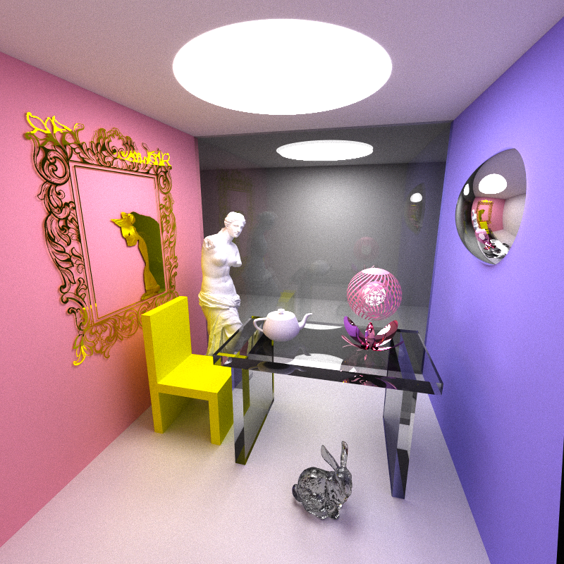

# $Ray$ 
[TOC]

## Introduction

## System

### Ray Tracing

The `RayTracing` module simulates light rays interacting with objects in a 3D environment to generate realistic images. Key features include:

- **Recursive Ray Tracing:** Traces rays up to a predefined maximum depth.

- **Multi-threading Support:** Distributes ray tracing tasks across multiple threads using a thread pool. Each thread Handles ray tracing for a subset of rays, suitable for parallel execution within a thread.

- **Image Accumulation:** Supports sampling over multiple iterations to smooth out noise in the rendered image.

The process of the **Trace Ray**.

- First load the scene files and initial the scene, which contain the camera and the object.
- For the camara, generate a full set of rays for the image. For all objects on the scene, we build the object tree base on the objects to organizes objects in a 3D scene into a binary tree structure. Next, for each sample iteration, do execute as following, 

- For each ray which generated by camera, recursively traces a ray through the scene, simulating interactions with objects, and calculates its resulting color.

  - **Find intersection**. Find the nearest intersection of the ray with objects in the scene. Check if recursion depth exceeds `MaxRayLevel`. If true, return the color of black. If find, then calculate the normal vector at the intersection point and align it to face the incoming ray. Recur with the new ray until termination or depth limit.

  - **Dielectric surface propagation**. Propagate the ray based on material properties of corresponding object. 
  - **Update** the ray and its color, recursively the next calculate.

- Finally, map the ray's result to the corresponding pixel in the image base on its coordinates. And normalize pixel values by the number of samples.

### Object Tree & Objects

The `ObjectTree` organizes objects in a 3D scene into a binary tree structure, and the primary goals of Object Tree structure are (1)  Efficient ray-object intersection testing. (2) Spatial organization to cull irrelevant objects quickly. Where each node contains:

- A reference to an object or a bounding box. A axis-aligned bounding boxes (AABBs) for partitioning space and is built recursively based on object positions.

- Links to child nodes (subtrees).

  

**Build the tree**. The processing of building the Object Tree using a recursive process. which This results in a balanced tree that minimizes the depth and ensures efficient traversal.

- Compute the bounding box of all objects in the current range.

- Determine the largest dimension of the bounding box.

- Sort objects along that dimension and split them into two groups.

- Recursively builds left and right subtrees for balanced partitioning.

  

**Ray Intersection**. Computes the nearest intersection between a ray and the objects in the tree.

- If the node is a leaf (contains an object), compute the intersection with that object.
- If the node is not a leaf, test if the ray intersects the node's bounding box.
- Recursively check child nodes for intersections, keeping track of the nearest valid intersection.
- Finally, Returns the distance to the nearest intersection and updates the pointer to the intersected object.

**TODO**

1. This `ObjectTree` implementation can be extended to support dynamic scenes, more advanced spatial partitioning (e.g., KD-trees), or additional optimizations for specific workloads.

The object has some properties:

- **Material**, refer to the optical effects of the object, including various properties related to the refraction, reflection and diffuse reflection.
- **Shape**, refer to the geometric effects of the object.