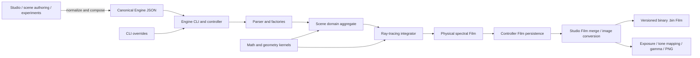
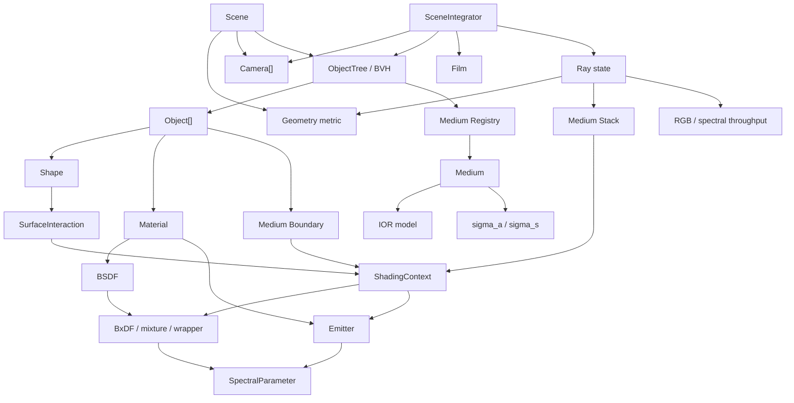
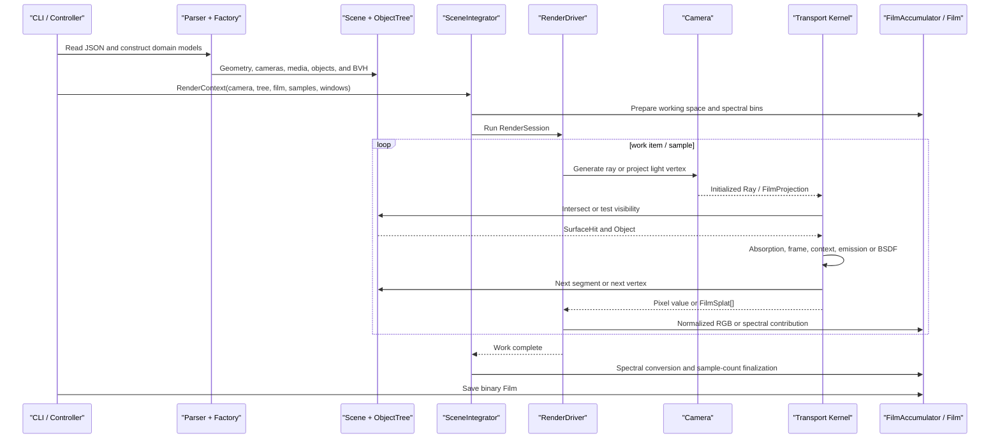

# Engine System Model Architecture and Rendering Pipeline

> This document treats the current Go implementation under `engine/` as the sole source of truth. It explains the Engine's system position, domain models, runtime collaboration, rendering lifecycle, capability boundaries, and extension model. It describes the code that exists, not a historical directory layout or an idealized target architecture.

## Architecture Summary

The Engine is a rendering execution core that accepts canonical scene JSON, constructs an in-memory domain model, evaluates Monte Carlo light transport, and writes a linear Film. It does not own the complete content-authoring, scene-composition, or asset workflow; those responsibilities belong to higher-level tools such as Studio.

Its central purpose is not merely to convert JSON into an image. It converts scene data into a collaborating set of models with geometric and physical meaning:

- `Scene` selects the spatial geometry, cameras, and intersectable object set.
- `Shape` describes a surface, its intersections, normals, bounds, and optional area-sampling capability.
- `Material` composes surface scattering and self-emission.
- `Medium` describes refractive index, absorption, and boundary state.
- `Optics` owns rays, spectra, wavelengths, and color state.
- `Camera` maps Film coordinates to initial rays; some cameras also support inverse projection.
- `Integrator` decides how paths are constructed, how pixel measurements are estimated, and how work is scheduled.
- `Film` owns physical spectral results, sample accounting, and persistence.

The governing structure is: domain models express meaning, while the renderer orchestrates behavior. A Shape does not know about an Integrator, a Material does not know about the BVH, a Camera does not know about a BSDF, and a Film does not know how its contributions were generated. Integrators combine these capabilities through stable contracts. This separation allows most new capabilities to be introduced as local model extensions instead of requiring a rewrite of the complete rendering path.

## System Position and Complete View



The Engine is the execution layer of the wider toolchain, not the authoring layer:

| Boundary | Owns | Does not own |
| --- | --- | --- |
| Studio and higher-level tools | Includes, scene composition, authoring conveniences, default assets, Film merging, and final image workflow | Core light transport |
| Engine controller | One canonical script, configuration resolution, model construction, render-job orchestration, and Film persistence | Multi-script composition and asset graphs |
| Engine model | Scene, space, shapes, materials, media, optics, cameras, and Film semantics | Integrator lifecycle and worker scheduling |
| Engine ray tracing | Path estimation, sampling, visibility, throughput, concurrent scheduling, and Film accumulation | JSON protocol details |
| Binary Film | Shape, sample count, wavelength bounds, and spectral planes | Observer, color-space, and display-image semantics |

Engine has no Film-to-image API. The controller persists the completed spectral
Film, after which Studio can merge Film files, perform CIE XYZ integration, and
apply the output color-space and display transform. Engine rendering and
display-image creation are therefore separate ownership boundaries.

## Layer Structure and Responsibility Boundaries

The current package layout can be organized into the following layers:

| Layer | Main package | Responsibility |
| --- | --- | --- |
| Process entry | `engine/main.go` | Delegates arguments to `controller.Run` and converts success or failure into an exit code |
| Application orchestration | `controller` | CLI overrides, defaults, script configuration, render-job expansion, camera/Film configuration, renderer invocation, and Film saving |
| Input adapter | `controller/parser` | Deserializes one JSON file into `Script` |
| Model factories | `controller/factory` | Validates input, resolves discriminators, parses expressions or STL, and constructs domain models |
| Domain core | `model/*` | Camera, Film, Shape, Object, Material, Medium, Optics, and Scene |
| Mathematical kernel | `maths/*` | Vectors, frames, sampling, tensors, equation solving, expression differentiation, and spatial metrics |
| Rendering execution | `ray_tracing` | Integrators, drivers, kernels, render sessions, path state, visibility, and contribution accumulation |
| Shared input helpers | `utils` | Typed-field extraction, numeric validation, global dimension, and small mathematical helpers |
| Diagnostic programs | `cmd/*` | Profiling and spectral ray/Film probes; these are not part of the main scene protocol |

The dependency direction is broadly outside-in: `controller` depends on the domain model and renderer; the renderer depends on the model and mathematical kernel; the domain model does not depend on the controller. Consequently, JSON field names and compatibility aliases do not leak into Shape, BSDF, or Integrator contracts.

The input layer makes a deliberate practical tradeoff. Materials, Objects, and Media partly use `map[string]interface{}` to support many heterogeneous discriminators, while Camera and Render use typed structures. Untyped maps reduce the protocol cost of adding model-specific fields, but they defer type safety to factories and generally ignore unknown fields. The factory boundary restores invariants before any value reaches the rendering hot path.

## Domain Model Overview



The graph exposes three important modeling principles:

- **Composition over inheritance.** An Object composes a Shape, Material, and MediumBoundary. A Material composes Surface and Emission. Mixtures compose multiple BxDFs.
- **Scene state is distinct from path state.** Scene, ObjectTree, and model parameters are effectively read-only during a render; Ray, MediumStack, throughput, and ShadingContext evolve along a path.
- **Required contracts are distinct from optional capabilities.** Every Shape is intersectable through its base contract, but only a `SurfaceSampler` can be an area light. Every Camera generates rays, but only a `ProjectiveCamera` can receive light-tracing splats.

## Scene Aggregate Root

`model.Scene` is the aggregate root after model construction:

```text
Scene
|- ObjectTree
|- Cameras[]
|- Geometry
`- MaxArc
```

It intentionally excludes the integrator, thread count, sample count, and output path. Those values belong to a Render Job rather than to the scene itself. A single Scene can therefore be reused by sequential jobs with different cameras, integrators, sampling policies, and output targets.

`Geometry == nil` is the compatibility sentinel for Euclidean space. Callers use `geometry.Get` to resolve it to the Euclidean singleton. This keeps older call sites compact, but it also means that “unspecified” and “explicitly Euclidean” share one in-memory representation.

`MaxArc` is a propagation budget, not a Shape parameter. It primarily bounds repeated great-circle travel in spherical space. When a spherical scene omits it, the factory assigns $2\pi$. Zero means unbounded travel in Euclidean and Klein scenes.

## Spatial Geometry Model

`maths/geometry.Geometry` promotes the space in which a ray propagates to a first-class domain capability. Its contract covers:

- geometry kind and embedding dimension;
- projection into a tangent space;
- the position-dependent inner product;
- conversion of an ambient gradient into an intrinsic normal;
- conversion of an embedded-ray parameter into geodesic arc length;
- exponential maps and geodesic directions;
- an embedded-ray representation for acceleration structures;
- spherical wrap behavior.

The supported spaces use different propagation and intersection representations:

| Geometry | Representation | Propagation and intersection | Main cost or limitation |
| --- | --- | --- | --- |
| Euclidean | $\mathbb{R}^n$, with $n=3$ by default | Affine rays and BVH traversal; core metric operations follow vector length | `Geometry.Dimension()` still reports 3; N-dimensional operation is supplied through `utils.Dimension` and model vectors |
| Klein | Unit-ball coordinates in $\mathbb{R}^3$ | Geodesics are Euclidean chords, so affine Shape intersection and the BVH are reusable; distance and angle use the Klein metric | Each hit requires metric normalization and arc-length conversion |
| Spherical | $S^3\subset\mathbb{R}^4$ | Great-circle geodesics call `Shape.IntersectGeodesic` and select the smallest arc-length hit by scanning Objects | The affine BVH cannot currently be reused |

The abstraction does not ask a Shape to infer the space. Geometry interprets propagation, length, inner products, and tangent spaces. Shape interprets how its implicit or parametric surface intersects an affine ray or geodesic. The renderer selects the correct query path.

The Euclidean methods themselves work with arbitrary vector lengths, but `Euclidean.Dimension()` still reports 3. The factory does not apply that metadata check to the nil Euclidean sentinel, so N-dimensional Euclidean support is currently supplied by the global dimension path. This is a compatibility design, not yet a completely unified Geometry/dimension model.

The local shading frame is also geometry-aware. `NewFrameFromNormalInGeometry` projects a normal into $T_pM$ and constructs orthonormal tangent vectors using the local metric. BSDFs can therefore continue to use one local coordinate convention, cosine factors, hemisphere sampling, and microfacet models even when world-space propagation is Euclidean, Klein, or spherical.

## Shape and Surface-Interaction Model

The required `shape.Shape` contract is:

```text
Name
IntersectAffine
IntersectGeodesic
GetNormalVector
BuildBoundingBox
```

An intersection produces `shape.SurfaceInteraction`, including distance, geodesic arc length, point, geometric and shading normals, UV coordinates, parametric derivatives, and primitive ID. The Object layer promotes it to `object.SurfaceHit` by adding the hit Object and `FrontFace`, and it uses Geometry to convert an ambient normal into an intrinsic normal.

Separating `IntersectAffine` and `IntersectGeodesic` has two advantages:

- Euclidean and Klein paths do not pay for a general curved-ray abstraction.
- Spherical support can be implemented Shape by Shape, and unsupported combinations explicitly return no hit instead of silently treating a great circle as an ambient line.

`SurfaceSampler` is a separate optional interface:

```text
SampleSurface(u) -> point, normal, UV, area PDF
SurfaceArea() -> area
```

It determines whether a Shape can be discovered as a finite area light by BDPT or Light Tracing. An optional capability is preferable to an empty method on every Shape because an Integrator can accurately distinguish “intersectable” from “area-sampleable.”

The concrete categories, mathematics, and intersection capabilities are documented in [Geometric Objects](geometric_objects.md).

## Object, BVH, and Scene Visibility

`object.Object` is the renderable entity:

```text
Object = Shape + Material + MediumBoundary
```

It binds geometry, optical surface behavior, and medium topology at one intersection. `ObjectTree` stores a flat Object array, BVH nodes, the Root, and a Medium Registry:

- the flat array is used for construction, spherical scans, and light discovery;
- the BVH serves Euclidean and Klein affine queries;
- the Medium Registry lets any path resolve its current medium from an ID.

The BVH uses a 12-bin binned surface-area heuristic to choose a split dimension and bin. If no valid SAH split exists, it falls back to a median split along the largest centroid extent. Traversal visits the nearer child first and tightens `tMax` after a hit, pruning farther nodes.

Dynamic updates support `Refit`, `Rebuild`, and `Auto`. Refit updates leaf bounds and propagates them through an unchanged topology; rebuild reconstructs all topology. The canonical JSON path builds the tree once after scene loading, but the domain model leaves room for programmatic animation or procedural updates.

Spherical great circles cannot be represented by one affine embedded ray, so `GetGeodesicSurfaceHit` currently scans all Objects. This is a deliberate correctness-first tradeoff: the Engine preserves curved-space semantics until an appropriate geodesic acceleration structure exists instead of misusing the AABB traversal.

## Material, BSDF, and Emission Models

The Engine has no top-level material subtype. Every Material has the same composition:

```text
Material
|- Surface: BSDF, optional
|- Emission: Emitter, optional
`- Metadata
```

At least one of Surface and Emission is required. A Surface exposes the common BSDF contract and may be backed by one BxDF, a weighted mixture, or a procedural wrapper. The core `Scattering` contract includes:

- `Eval`, which evaluates $f(\omega_i,\omega_o)$;
- `Sample`, which returns a direction, value, PDF, event flags, and transmission state;
- `PDF`, which reports the directional sampling density;
- `AlbedoBound`, which supplies a throughput bound;
- `RoughnessInfo`, which reports roughness and delta metadata;
- `DeltaFlags`, which reports discrete reflection, discrete transmission, non-reciprocity, and transmission events.

These methods are not merely classification metadata. Integrators consume the flags to decide:

- whether an event exists only as a discrete sample;
- whether a BDPT continuous strategy may connect a vertex;
- whether the MediumStack must change;
- whether a non-reciprocal model invalidates bidirectional assumptions.

A weighted mixture uses component weights for both component selection and the mixture PDF. A non-delta sample is re-evaluated under the complete mixture $f$ and $p$; a delta sample retains its discrete branch and is scaled by the selection probability. The composite material therefore still obeys one estimator contract, without requiring Integrators to understand concrete material classes.

`Emitter` requires `Emit` and `IsDelta`. Camera-path tracing multiplies emission into throughput and terminates at an emissive hit; if the same Material also has a Surface, the current path implementation does not continue scattering at that hit. BDPT and Light Tracing discover objects that combine an Emitter with a `SurfaceSampler` Shape and construct an area-light distribution during render preparation.

Concrete material categories, model equations, and schemas are documented in [Collection of Materials](collection_of_materials.md).

## Medium and Boundary-State Model

A Medium is a scene-level registered resource, not a Material subtype. Its contract provides:

```text
IOR(context)
SigmaA(context)
SigmaS(context)
```

The current concrete model is homogeneous. IOR may be constant or Cauchy-dispersive, while coefficients may be RGB or sampled spectra. Absorption participates in Beer--Lambert segment attenuation:

$$
T_k(\lambda)=\exp\!\left[-\sigma_a(\lambda)d_k\right].
$$

`sigma_s` is parsed and stored, but current Integrators do not sample medium-scattering events. It therefore produces neither in-scattering nor out-scattering.

Each Ray owns a `MediumStack`. An Object's `MediumBoundary` describes outside, inside, priority, and thin behavior. At a hit:

- `FrontFace` and the current stack determine incident and candidate transmitted media.
- ShadingContext receives $\eta_i$, $\eta_t$, the medium IDs, and the entering state.
- The stack changes only if BSDF sampling returns `TransmissionEvent`.
- A non-thin boundary pushes or removes entries; overlapping media use priority to choose the current medium.
- A thin boundary supplies two interface IORs without persistently modifying the stack.

The sequence “resolve a candidate transition, then commit it only after transmission sampling” is transaction-like. A reflection branch cannot accidentally enter another medium, and a geometric hit alone cannot corrupt nested-medium state.

## Optics, Ray, and Spectral State

`optics.Ray` is more than an origin and direction. It is the mutable state carrier for a camera path:

| State | Purpose |
| --- | --- |
| `Origin`, `Direction` | Current embedded/world position and tangent direction |
| `Color` | RGB path throughput |
| `SpectralPower` | Single-wavelength path throughput |
| `WaveLength`, `WavelengthPDF` | Active wavelength and its sampling density |
| `RGBCompatibility` | Compatibility product when a spectral ray encounters an RGB-only value |
| `RefractionIndex` | Current IOR snapshot |
| `MediumStack` | Current medium topology |
| `Geometry` | Space in which the path propagates |
| `ArcTraveled` | Accumulated geodesic distance |

Rays are reused through `sync.Pool`. The renderer writes the Scene Geometry after acquiring a Ray and before calling `GenerateRay`; `GenerateRay` calls `Init` to reset the remaining path state. Geometry is intentionally not cleared by `Init`, and specialized non-Euclidean cameras may set it again. This reduces per-sample allocations, but every new path-state field must be added to the initialization invariant.

`Spectrum` has two actual storage kinds: RGB and sampled. Render mode chooses RGB transport, one hero wavelength, or multiple independent monochromatic samples. Wavelength sampling, RGB uplift, spectral Film conversion, and CIE XYZ mapping are documented in [Spectra and Color Spaces](spectrum_and_color.md).

## Camera and Film Models

The minimum Camera contract is `GenerateRay`. Current camera models are:

| Camera | Role |
| --- | --- |
| `Camera3D` | Three-dimensional perspective camera implementing `ProjectiveCamera`; its `Ortho` field is parsed but does not currently change ray generation |
| `CameraNDim` | N-dimensional Film coordinates with N+1 camera basis vectors; its orthographic branch is implemented |
| `HyperbolicCamera` | Constructs a camera tangent frame under the Klein $H^3$ metric |
| `SphericalCamera` | Places a camera on $S^3\subset\mathbb{R}^4$ with three tangent camera-basis vectors |

`Prepare` turns authored parameters into cached orthonormal bases, FOV tangents, and reciprocal resolutions. `GenerateRay` jitters within the pixel, initializes the Ray, and writes its origin and direction. Ordinary cameras preserve the Geometry supplied by the renderer, while non-Euclidean cameras explicitly confirm their own Geometry.

`ProjectiveCamera` additionally provides `ProjectPoint`, which maps a light-path vertex to a pixel and returns distance, direction to the camera, and a measurement Jacobian. Light Tracing requires this capability. BDPT uses it only for the separate delta-caustic splat family.

Film uses equal-shaped spectral-bin Tensors, so its storage supports both
two-dimensional images and N-dimensional Film domains. It stores the shape,
effective sample count, wavelength range, and physical spectral contributions.
It deliberately has no observer or display channels. Studio arranges
more-than-two-dimensional Films as a two-dimensional atlas during image output.

## Integrator, Driver, and Kernel Architecture

The most important execution-layer design decision is the separation of estimator algorithms from work distribution:

```text
SceneIntegrator
`- configuredSceneIntegrator
   |- Handler: transport policy and shared tracing operations
   `- RenderDriver
      |- pixelDriver + pixelKernel
      `- splatDriver + splatKernel
```

`SceneIntegrator` owns the complete lifecycle of one render. `RenderDriver` decides:

- what constitutes a work item;
- how workers claim work;
- whether arbitrary concurrent Film writes are possible;
- what effective sample count is recorded.

Kernels implement algorithm-specific operations:

| Integrator | Driver | Kernel | Write model |
| --- | --- | --- | --- |
| Path Tracing | `pixelDriver` | `pathTracingKernel` | One worker owns each tile/pixel and sets that pixel directly |
| BDPT | `splatDriver` | `bdptKernel` | A global work sample may splat into arbitrary pixels |
| Light Tracing | `splatDriver` | `lightTracingKernel` | Every eligible light-path vertex may splat into an arbitrary pixel |

The pixel driver distributes 8×8 tiles by default through an atomic next-tile index. A pixel belongs to exactly one tile, so Film writes need no per-pixel mutex. A splat driver can receive contributions to the same pixel from different workers, so `FilmAccumulator` allocates one lock per pixel. Keeping synchronization in the Driver avoids both unnecessary Path Tracing locks and unsafe Light Tracing writes.

`RenderSession` centralizes Context validation, Film preparation, accumulator construction, and finalization. All Integrators therefore share:

- spectral-bin initialization;
- spectral write entry points;
- `Film.Samples` accounting.

The estimator mathematics, MIS strategies, and unbiasedness conditions are documented in [Integrator](integrator.md).

## Rendering Mathematical Contract

The Engine's surface-transport background is the wavelength-dependent rendering equation:

$$
L_o(x,\omega_o,\lambda)
=L_e(x,\omega_o,\lambda)
+\int\limits_{\mathcal H(x)}
f_s(x,\omega_i,\omega_o,\lambda)
L_i(x,\omega_i,\lambda)
|n\cdot\omega_i|\,d\omega_i.
$$

For one non-delta camera-path bounce, throughput is updated approximately as

$$
\beta_{k+1}
=\beta_k T_k
\frac{f_k(\omega_i,\omega_o)|\cos\theta_i|}
{p_\omega(\omega_i\mid\omega_o)}.
$$

After Russian roulette survival, throughput is divided by the survival probability $q_k$:

$$
\beta_{k+1}\leftarrow\frac{\beta_{k+1}}{q_k}.
$$

Roulette starts at depth 3 by default. Survival is estimated from the largest RGB channel or spectral throughput and clamped to $[0.05,1]$. Finite maximum depth and `MaxArc` truncate the theoretically infinite path family, so unbiasedness must be discussed relative to the Engine's supported, truncated model.

For $N$ Monte Carlo samples, the Film estimator has the general form

$$
\widehat I_p
=\frac{1}{N}
\sum\limits_{i=1}^{N}
\frac{F_p(X_i)}{p(X_i)}.
$$

The pixel driver forms its average within a pixel. The splat driver divides all contributions by total work during accumulation. Spectral paths additionally compensate for the wavelength PDF and convert their spectral bins into XYZ and the selected Film space during finalization.

## Scene Construction from Input

### Process Startup and Argument Parsing

`main` calls `controller.Run(args)`. The controller parses CLI overrides and validates the integrator, spectrum mode, working space, tone mapping, worker count, dimensions, sample count, and pixel-window ranges. The Engine accepts exactly one `--script`; multi-file authoring composition belongs above this boundary.

### Script Deserialization

`ReadScriptFile` resolves an absolute path and uses the standard JSON decoder to construct `parser.Script`. The top level contains materials, media, objects, cameras, geometry, render, and renders. This stage performs structural deserialization; most domain validation occurs in factories.

### Spatial Geometry and Dimension Initialization

`LoadSceneFromScript` resets the Scene and resolves Geometry first. Scene dimension comes from `script.render.dimension`, with a default of three, and is written through `utils.SetDimension`. Shape and Camera factories subsequently use it to validate vector lengths and construct bounds.

Dimension is therefore a **scene-construction parameter**, not merely a sampling option. Changing `RenderContext.Dimension` after model construction does not rebuild Shapes, Cameras, or the BVH.

### Resource Model Construction

Factories build resources in dependency order:

- Parse the Material table into `id -> *Material`.
- Parse the Medium Registry, preinstall air, and register scene media.
- Traverse Objects and resolve each Material reference, Shape, optional bounds, and MediumBoundary.
- Allow one STL or compound parser result to expand into several runtime Shape/Object pairs.
- Parse Cameras and validate their compatibility with Geometry.
- Aggregate object and camera errors, then build the BVH only after successful model construction.

String references are resolved into pointers or IDs during loading rather than at every bounce. Protocol flexibility is confined to the construction boundary, while the hot path operates on domain objects.

### Render Job Expansion

The controller starts from Engine defaults and applies configuration in this order:

```text
Engine defaults
-> top-level render
-> one renders[] entry
-> CLI overrides
```

When `renders[]` exists, the Scene is loaded once. Each job sequentially selects and prepares a Camera, creates a new Film, normalizes PixelWindows, builds a new ray-tracing Handler, renders, and saves its own output. The heavy Scene, ObjectTree, Materials, and Camera objects are reused, while Film and render policy remain job-local.

## Complete Rendering Pipeline



### RenderContext and Session Preparation

The controller places the ActiveCamera, ObjectTree, Film, sample count, and PixelWindows into `RenderContext`. `NewSceneIntegrator` maps a canonical `IntegratorKind` to its Driver/Kernel pair. `newRenderSession` validates non-nil inputs, reconciles Handler and Film working spaces, and creates 64 spectral bins over 380--750 nm for non-RGB modes.

### Work-Domain Generation and Concurrent Scheduling

Path Tracing builds tiles from Film shape and PixelWindows. A two-dimensional Film uses rectangular tiles; an N-dimensional Film is flattened into linear chunks. Worker goroutines claim the next tile through an atomic index.

BDPT defines global work as active pixels multiplied by camera samples and, in sampled mode, wavelength strata. Light Tracing defines its global light-path count as active pixels multiplied by samples. The splat driver only consumes a work count and returned `FilmSplat[]`; it does not understand the internal path mathematics.

### Camera Sampling and Ray Initialization

Path and BDPT camera subpaths call `GenerateRay` with Film coordinates. The Camera jitters within the pixel and initializes:

- unit RGB throughput or spectral power;
- an air MediumStack;
- an IOR of one;
- wavelength state;
- accumulated arc length.

Geometry is supplied by the renderer before camera invocation and preserved through `Ray.Init`; a non-Euclidean Camera may explicitly set it again.

RGB mode disables wavelength sampling. Hero mode selects one random wavelength. Sampled mode creates several stratified wavelengths per camera sample, but every wavelength still follows an independent geometric path.

### Geometry-Dependent Intersection

Every bounce first checks maximum depth and Russian roulette, then selects an intersection path from Geometry:

- Euclidean and Klein use `EmbeddedRay` to obtain the origin, direction, and natural `tMax` needed by the BVH.
- Spherical tracing asks every Shape for a geodesic intersection over the half-circle interval $[\varepsilon,\pi]$.

An Euclidean or Klein miss terminates with black. A spherical miss may call `WrapBeyond(\pi)` at the antipode, advance total arc length, and continue if `MaxArc` permits.

### Segment Transport and Path Distance

After a hit, the embedded parameter is converted to geodesic length $d_k$. Absorption in the current Medium acts on the entire segment **before** the surface interaction:

$$
\beta\leftarrow\beta\exp[-\sigma_a d_k].
$$

The renderer then advances `ArcTraveled` and checks the arc budget. This order ensures that absorption uses physical/geodesic path length rather than a Klein chord parameter.

### SurfaceInteraction and ShadingContext

The renderer moves Ray origin to the hit point, renormalizes direction under the active Geometry, constructs a metric-orthonormal Frame, and transforms the outgoing direction into local coordinates.

`ShadingContext` gathers all transient state required by collaborating models:

- radiance or importance transport mode;
- spectrum mode, wavelength, and wavelength PDF;
- current, incident, and transmitted IORs and Medium IDs;
- entering or exiting state;
- world-space geometric normal and hit point;
- UV coordinates;
- Object AABB.

Shape produces geometry, Ray and MediumStack produce path state, and Material consumes a context. The renderer is the assembly point for all three.

### Emission and Surface Branches

If the hit Material has Emission, Path Tracing evaluates `Emit(ctx, wo)`, multiplies it into throughput, and terminates the path. Otherwise a Surface must be present.

The renderer passes a two-dimensional random sample to `Surface.Sample`. It rejects a non-positive PDF, non-finite values, or a negative Spectrum, then applies

$$
\beta\leftarrow\beta
\frac{f|\cos\theta_i|}{p_\omega}.
$$

If the sample contains `TransmissionEvent`, the pending MediumBoundary transition is committed. If `sample.WavelengthNM > 0`, the current implementation only marks the path as genuinely spectral; it does not replace the already selected hero wavelength during a bounce.

### Next Direction and Recursion

The sampled local `Wi` is transformed back into world space. Geometry projects it into $T_pM$ and normalizes it using the local metric. The renderer then recursively traces the next bounce.

This boundary is essential to cross-geometry material reuse: BSDFs always operate in a local orthonormal space, while Geometry owns world-space propagation.

### Integrator Differences

Path Tracing constructs only a camera path. It neither explicitly samples a light nor connects light vertices. It can see every intersectable emitter, but it is inefficient for small lights and caustics.

BDPT discovers finite sampleable area lights during render preparation, analyzes Geometry and non-reciprocal capabilities, and builds camera and light subpaths per sample. Continuous strategies connect vertices with MIS; supported delta-caustic paths use a separate camera-splat family. A non-Euclidean scene, non-reciprocal surface, or absence of a sampleable finite area light triggers a Path estimator fallback while retaining the BDPT splat driver.

Light Tracing builds light subpaths from area lights and projects every eligible non-delta vertex into a `ProjectiveCamera`. A missing projective camera is a hard error. If no sampleable light exists, work count is zero.

### Film Accumulation and Finalization

RGB contributions are converted into the selected Film working space. Spectral contributions are compensated by wavelength PDF and written to the corresponding bin. The pixel driver normalizes within a pixel; the splat driver scales contributions by total work during accumulation.

Spectral Film finalization performs:

```text
active-wavelength path contributions
-> spectral Film bins
```

Finally, the Driver's sample-accounting value is written to `Film.Samples`. Sampled Path Tracing records camera samples multiplied by wavelength samples. The splat driver currently records configured `samples` for both BDPT and Light Tracing, even though BDPT total work also contains active-pixel and wavelength-stratum factors. `Film.Samples` is therefore a Driver-specific statistical accounting value, not a universally identical count of traced geometric paths.

### Persistence and Display Output

The controller saves Film v3 as a little-endian binary stream containing sample
count, shape, wavelength bounds, and mandatory spectral planes. The Engine CLI
finishes at this physical-measurement boundary.

Studio or another consumer may load and sample-weight merge Films before applying:

```text
spectral Film -> CIE XYZ -> selected Studio color space -> linear sRGB
-> exposure -> tone map -> clamp -> gamma -> 8-bit image
```

For an N-dimensional Film, the first two dimensions become each atlas tile's width and height, while remaining dimensions are flattened into slices. Display conversion is lossy; binary Film retains physical spectral results, so merging and numerical analysis belong before image encoding.

## State Lifecycles

| Lifetime | Typical objects | Mutability and ownership |
| --- | --- | --- |
| Process | `utils.Dimension`, global random source | Dimension is set while building a Scene; the process is not suited to concurrent Scenes with different dimensions |
| Script | `parser.Script` | Read-only after loading; retains protocol shape |
| Scene | Geometry, ObjectTree, Materials, Media, Cameras | Constructed once and reused by sequential Render Jobs |
| Render Job | `RenderContext`, Camera, Film, ray-tracing Handler | New or re-prepared for every job |
| Render Session | Driver, prepared Kernel state, Accumulator, active mask | Created at render start and discarded after Finalize |
| Worker | Tile/work index and local path/subpath | Goroutine-local where possible |
| Path | Ray, MediumStack, throughput, wavelength, arc | Initialized per sample, changed per bounce, and pool-reused |
| Hit | SurfaceHit, Frame, ShadingContext, BxDFSample | Temporary values for one interaction |
| Film | Channel tensors, spectral bins, per-pixel locks | Accumulated across samples; synchronization is selected by the Driver |

These lifetimes are architecturally significant. Storing hit state in Material would create shared mutable state. Storing render policy in Scene would obstruct multi-job reuse. Embedding Film synchronization in every Integrator would duplicate concurrency code. Context, Session, Ray, and Accumulator mostly place state at its correct lifetime.

## Supported Capability Range

| Capability | Supporting models | Why the architecture supports it | Current boundary |
| --- | --- | --- | --- |
| Analytic, implicit, and parametric surfaces | Shape interface, factory discriminator, equation solvers | One intersection contract hides concrete mathematics | Plane is declared but not implemented; Geometry support varies by Shape |
| STL and multiple primitives | One authored entry can expand into many Triangle Objects and one BVH | Protocol object count is decoupled from runtime primitive count | Expansion occurs at load time; no mesh-level shared-data model |
| N-dimensional Film, Camera, and Shape | Tensor, CameraNDim, global Dimension, N-dimensional bounds and frames | Film shape and coordinates are not fixed to 2D/3D | Several algorithms retain 3D assumptions; global Dimension prevents safe multi-Scene concurrency |
| Euclidean, Klein, and spherical propagation | Geometry metric, geometry-aware frame, dual intersection contract | Propagation semantics are separate from surface and material semantics | BDPT is Euclidean-only; spherical intersections lack BVH acceleration |
| Physical and procedural materials | BSDF/BxDF/Emitter composition | Eval/Sample/PDF form a common estimator contract | Parts of MaterialMetadata are not integrated into a complete runtime registry |
| Nested and overlapping media | Registry, Boundary, and priority MediumStack | Medium topology is per-path state committed after transmission | Absorption only; no volume-scattering event model |
| RGB and spectral rendering | Spectrum, SpectralParameter, WavelengthContext, spectral Film | Materials return RGB or sampled values through the same context contract | RGB uplift and parts of color management are approximate |
| Multiple Integrators | SceneIntegrator, Driver/Kernel, shared Session | Estimator algorithm is separate from scheduling and accumulation | Some combinations require an explicit capability gate or fallback |
| Pixel windows and concurrency | N-dimensional window normalization, tiles/masks, atomic work allocation | Work domains are independent of transport kernels | No public random seed; strict reproducibility is limited |
| Multiple Render Jobs | Scene/RenderContext separation and a new Film per job | Heavy models are reused while output and sampling policy remain local | Jobs run sequentially; Scene-level dimension cannot truly change per job |
| Linear post-processing workflow | Film working space, sample-weighted merge, binary persistence | Display transforms are separate from transport results | The Engine CLI does not directly emit PNG |

## Design Principles and Engineering Tradeoffs

### Domain Semantics First

Interfaces describe graphics semantics rather than file layout. `Shape.IntersectGeodesic`, `BxDFSample.Flags`, `FilmProjection.Jacobian`, and `MediumStack.ResolveTransition` directly express information required by rendering algorithms. The renderer never needs to inspect a JSON field to infer physical behavior.

### Boundary Canonicalization

Compatibility aliases and weakly typed input exist at parser, factory, and configuration boundaries. An Integrator sees canonical `IntegratorKind`; an Object contains a Material pointer and Medium IDs; the hot path no longer handles protocol strings. This improves performance, readability, and error localization.

### Optional Capability Interfaces

`SurfaceSampler` and `ProjectiveCamera` let algorithms state their real requirements. The tradeoff is that some combinations can only be confirmed through runtime capability checks during render preparation. Every new model must therefore be evaluated against the complete Integrator support matrix.

### Shared Lifecycle, Different Execution Models

Driver/Kernel separation does not force every estimator into a per-pixel abstraction. Path Tracing preserves lock-free pixel ownership, while BDPT and Light Tracing receive safe arbitrary splats. This reflects algorithm semantics more accurately than an overly general `SamplePixel` interface.

### Correctness-First Non-Euclidean Abstraction

Spherical intersection temporarily gives up BVH acceleration rather than incorrectly treating a great circle as an ambient line. Klein reuses the BVH specifically because its geodesics are chords. The abstraction allows every Geometry to choose a mathematically correct representation instead of pursuing superficial implementation uniformity.

### Localized Mutable State

MediumStack, throughput, wavelength, and arc belong to Ray. ShadingContext belongs to one hit. Synchronization belongs to the Accumulator. Model parameters are read-only during sampling. This localization is the foundation of worker-level concurrency safety.

### Explicit Performance Tradeoffs

- Ray pooling reduces allocations but enlarges the initialization invariant.
- Camera caches avoid reconstructing a basis per ray but must be refreshed after configuration changes.
- Binned SAH balances build cost and traversal quality without the expense of exhaustive SAH.
- A recursive path walker expresses bounce state clearly but couples maximum depth to stack and truncation policy.
- Per-pixel locks are created only for splat drivers, avoiding the normal Path Tracing overhead.

## Extending the Architecture

### New Shape

Implement affine and geodesic intersection, normal generation, and a conservative bounding box, then register a discriminator and validation logic in the Shape factory. Implement `SurfaceSampler` only if the Shape can serve as an area light. Tests should cover:

- valid intervals and nearest-root selection;
- normal orientation and `FrontFace`;
- conservative bounds;
- explicit support or rejection for every Geometry;
- consistency between area and area PDF.

The renderer and existing Materials require no change unless the Shape introduces a fundamentally new interaction category.

### New Material or BxDF

Implement the complete `Scattering` contract, expose it through `bsdf.Single` or a composition wrapper, and register it in the Material factory. `Eval`, `Sample`, and `PDF` must use the same measure. Delta, Transmission, and NonReciprocal flags must be exact because they change Medium state and BDPT strategy availability. `material/validation.go` provides non-negativity, reciprocity, energy, and sample/PDF consistency checks.

### New Emitter

Implement `Emit` and `IsDelta`, then add a parser branch. To be actively sampled by a light-based Integrator, its Shape must also implement `SurfaceSampler`. Point, directional, or environment lights should eventually introduce a distinct light-sampling domain rather than masquerading as zero-area Shapes.

### New Medium Capability

A new static medium parameter can implement `Medium`, an IOR Model, or a Coefficient without modifying Shape. Volume scattering requires much more than parsing `sigma_s`:

- free-flight distance sampling;
- a phase-function domain model;
- unified surface/medium event state;
- shadow-segment transmittance and MIS measures;
- medium-vertex support in every Integrator.

This feature crosses domain boundaries and should add explicit contracts rather than being inserted into a surface BxDF.

### New Geometry

Implement the metric, exponential map, tangent projection, intrinsic normal, and propagation representation, and provide a compatible Camera. Then implement or reject geodesic intersection Shape by Shape and add capability analysis for every Integrator. If the new geodesics admit an acceleration representation, introduce a Geometry-specific acceleration adapter without changing Material semantics.

### New Camera

Implement `Camera.GenerateRay` for camera-path support. Implement `ProjectiveCamera` as well if Light Tracing or camera splats are required, including a Jacobian consistent with the raster filter. The Camera factory owns protocol registration and parameter validation.

### New Integrator

First identify the execution model:

- a per-pixel estimator can reuse `pixelDriver` with a new `pixelKernel`;
- an arbitrary-splat estimator can reuse `splatDriver` with a new `splatKernel`;
- a fundamentally different schedule should implement `RenderDriver`.

Then register the canonical kind in `NewSceneIntegrator`. The new algorithm should reuse RenderSession, FilmAccumulator, Geometry intersection, Medium transmittance, and Spectrum conversion instead of duplicating state and normalization logic.

### New Color or Spectral Capability

A new Film working space needs bidirectional linear transforms, serialization compatibility, and merge validation. A new wavelength sampler can be injected through `Handler.WavelengthSampler`; exposing it to JSON only requires Render schema/configuration work, not Material changes. True spectral packet tracing would change the one-to-one relationship between a sampled Spectrum and a geometric path, so it requires a new path-state contract rather than merely increasing `wavelength_samples`.

## Current Architectural Limits and Evolution Priorities

### Input and Model Construction Remain Coupled

Factories register Shape, Material, Camera, and IOR types through explicit switches. This makes control flow and errors clear, but plugin-like extension requires editing a central factory. A typed registry could reduce that pressure as model count grows, provided canonical discriminators and construction-time validation remain intact. Raw JSON maps should not enter the runtime model.

### Dimension Is Process-Global State

`utils.Dimension` is set while loading a Scene and read by several Shape and Camera factories. This simplifies older N-dimensional code but prevents safe concurrent construction or rendering of Scenes with different dimensions. A stronger design would place Dimension in a SceneBuildContext, Shape, or Geometry and gradually remove global reads.

### Scene Configuration and Render Overrides Cross Lifecycle Boundaries

The Scene is built before CLI overrides are merged, while Dimension changes Shape, Camera, and BVH construction. `--dimension` and per-job dimension therefore cannot behave like sample count after model construction. Geometry and dimension should be classified as SceneBuildConfig, or the Scene should be rebuilt when either changes.

Canonical Engine JSON selects a camera by `camera_id`. Each Camera owns its Film, so render-job inheritance no longer needs a camera-index sentinel or duplicated Film dimensions. CLI overrides remain operational controls applied after the selected camera and Film are resolved.

### Capability Metadata Is Distributed

Geometry kind, Shape optional interfaces, Camera optional interfaces, BxDF flags, and MaterialMetadata jointly determine the support matrix. Checks currently live in factories, BDPT preparation, and kernels. A read-only `SceneCapabilities` report could centralize effective-integrator, fallback, and unsupported-reason diagnostics without replacing the underlying interfaces.

### Light Transport Remains Surface-Centered

The Engine has no environment emission, volume scattering, wavelength conversion, or complete sensor model. Parsed `sigma_s`, Emitter delta metadata, and differentiability-related metadata reserve semantic space for future work, but they do not mean those capabilities are implemented.

### Reproducibility and Random-Number Policy

Sampling directly uses the global `math/rand/v2` source. There is no public render seed or deterministic per-pixel stream, and different worker scheduling may change sample order. Strict regression tests, distributed tiles, and resumable rendering would benefit from making RNG/Sampler an explicit RenderSession dependency keyed by sample identity.

### The Output Boundary Is Clear but Split Across Two User Stages

Separating linear Film from display imagery is architecturally sound, but Engine configuration still carries exposure, tone, and gamma values that the CLI does not apply when saving Film. The long-term interface should either classify those controls exclusively as Studio/output-stage options or let the Engine CLI optionally emit an image while always retaining Film.

## Architectural Conclusion

The Engine is not a flat set of parallel modules. It is a state-transition chain connected by domain contracts:

```text
canonical data
-> validated domain models
-> Scene aggregate and acceleration
-> Render Job policy
-> Integrator execution model
-> per-path geometric and optical state
-> per-hit shading context
-> normalized Film contributions
-> linear Film
-> display output
```

It can support many Shapes, Materials, spectral modes, N-dimensional Cameras, non-Euclidean spaces, and three Integrators because the following boundaries mostly hold:

- geometric propagation is separate from surface mathematics;
- surface mathematics is separate from scattering models;
- read-only Scene models are separate from mutable path state;
- estimator kernels are separate from concurrent work drivers;
- light-transport results are separate from display transforms;
- required contracts are separate from optional capability interfaces.

Future extension depends less on adding another switch case than on preserving these mathematical and lifecycle boundaries. Every new capability should answer: Which Scene, Render, Path, or Hit lifetime owns it? Which measure and state does it use? Which Integrators can consume it? If those questions have no clear answer, the domain contract needs to evolve before the hot path is modified.

## Related Documentation and Source Entry Points

| Topic | Documentation or source |
| --- | --- |
| Engine JSON protocol | [Engine JSON Protocol](engine_json_protocol.md) |
| Shape mathematics and implementation | [Geometric Objects](geometric_objects.md) |
| Material mathematics and implementation | [Collection of Materials](collection_of_materials.md) |
| Integrator mathematics and unbiasedness | [Integrator](integrator.md) |
| Spectra and color spaces | [Spectra and Color Spaces](spectrum_and_color.md) |
| Application entry and Render Jobs | `engine/main.go`, `engine/controller/handler.go`, `engine/controller/render_context.go` |
| Script and factories | `engine/controller/parser/`, `engine/controller/factory/` |
| Scene and domain models | `engine/model/` |
| Geometry metrics | `engine/maths/geometry/` |
| Integrator lifecycle | `engine/ray_tracing/integrator.go`, `render_driver.go`, `render_session.go` |
| Camera-path loop | `engine/ray_tracing/trace_ray.go` |
| Medium and throughput | `engine/ray_tracing/medium_transport.go`, `throughput.go` |
| Film and output conversion | `engine/model/camera/film.go` |
