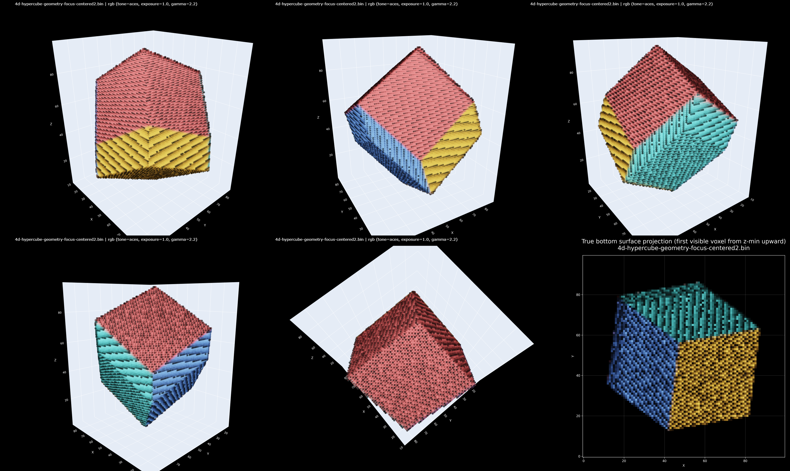
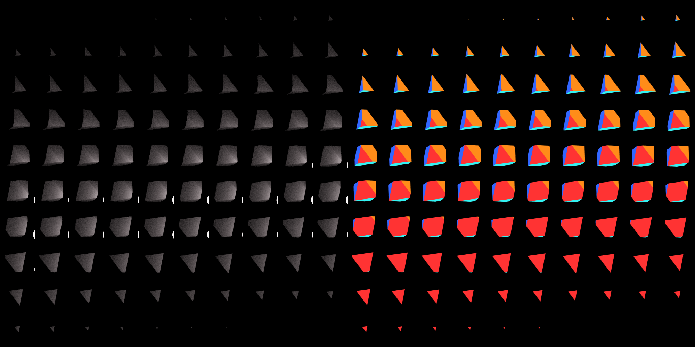

# Multidimensional Rendering and 4D Geometry Experiments

This document records the current multidimensional rendering capability and the
geometry experiments used to validate it. The focus is mathematical: how
higher-dimensional objects are represented, how they are observed through a
lower-dimensional camera domain, and what geometric conclusions the resulting
images make visible.

## 1. Implemented Capability

The renderer now supports scene-level runtime dimension selection through the
`render.dimension` field. A 3D render remains the default, while 4D scenes set:

```json
{
  "render": {
    "dimension": 4
  }
}
```

When the scene is loaded, this value updates the global working dimension used
by vector parsing, rays, cuboids, spheres, bounding boxes, object construction,
and camera validation. This makes the same geometric interfaces usable for
ordinary 3D primitives and for higher-dimensional analogues such as
hypercuboids, hypercubes, and hyperspheres.

Relevant code:

- `engine/utils/global.go`
- `engine/controller/factory/scene.go`
- `engine/controller/factory/cameras.go`
- `engine/controller/factory/shapes.go`
- `engine/model/camera/camera_n_dim.go`
- `engine/model/camera/film.go`
- `engine/model/shape/cuboid.go`
- `engine/model/shape/sphere.go`

## 2. N-Dimensional Camera as a Measurement Model

The `n_dim` camera describes an observation subspace inside an ambient
N-dimensional scene. It stores:

- a camera position in N-dimensional coordinates,
- one forward basis vector,
- one image-axis basis vector for each film dimension,
- one film width per image axis,
- one field-of-view value per image axis.

For a 4D scene with a 3D film, the camera therefore uses four basis vectors:
one forward direction and three sensor directions. The film shape may be
`[100, 100, 100]`, meaning that the camera samples a three-dimensional image
domain rather than a flat two-dimensional image. The film stores this as a
tensor-valued measurement and exports higher-dimensional films as 2D slice
atlases when written to PNG.

Example:

```json
{
  "id": "outside-4d-orthographic-geometry-camera",
  "type": "n_dim",
  "position": [-3.97836, -0.716105, 0.477403, -1.67091],
  "coordinates": [
    [1.0, 0.18, -0.12, 0.42],
    [0.24, 1.0, 0.12, -0.58],
    [-0.32, 0.08, 1.0, 0.36],
    [0.42, -0.50, 0.34, 1.0]
  ],
  "widths": [100, 100, 100],
  "field_of_views": [120, 120, 120],
  "ortho": true
}
```

The camera orthonormalizes the supplied basis vectors before use. In
orthographic mode, the ray direction remains the forward basis direction, while
the origin is shifted inside the three-dimensional camera domain. In perspective
mode, the sampled coordinates perturb the ray direction instead.

## 3. Hypercube and Hypersphere Geometry

The current 4D showcase scenes use two direct higher-dimensional shapes:

- `hypercube`, parsed as an equal-sided N-dimensional cuboid,
- `hypersphere`, parsed as an N-dimensional sphere.

For a 4D hypercube, the boundary is made of eight cubic cells. This is the
central geometric fact used by the experiments. It is the 4D analogue of the
3D fact that a cube is bounded by six square faces. A hypercube vertex is
incident to four cubic cells, just as a cube vertex is incident to three square
faces.

The cell-palette emission material is provided specifically to expose this
structure. It maps the dominant axis of the geometric normal to a color. For an
axis-aligned 4D hypercube, this assigns distinct colors to the eight cells
`-X`, `+X`, `-Y`, `+Y`, `-Z`, `+Z`, `-W`, and `+W`, allowing cell identity to
survive projection.

## 4. Exterior Hypercube Cell Decomposition

Scene:

- `examples/scenes/4d-hypercube/4d-hypercube-geometry-focus-direct.json`

Result:



This experiment visualizes a four-dimensional hypercube from an exterior
viewpoint and examines how its eight cubic cells appear after projection into a
three-dimensional volume. In the figure, the projected object is shown from
several viewing angles, together with a bottom-surface projection. The key
feature is that the object does not appear as a single undifferentiated solid.
Instead, it is divided into colored volumetric regions, each corresponding to
one cubic cell of the original 4D hypercube.

The visible red, cyan, yellow, and blue regions should be interpreted as
projected 3D cells rather than ordinary colored faces. From the outside, these
cells form a cube-like envelope, but their boundaries reveal the
higher-dimensional structure behind it. Different colored volumes meet along
shared planes, edges, and vertices, showing how the 4D hypercube boundary is
assembled from cubic components. This is the direct 4D analogue of a 3D cube
being assembled from six square faces, except that the hypercube is assembled
from eight cubes.

The point-sampled volume representation makes this incidence structure easier
to observe. The dotted layers expose the spatial distribution of projected
cells, while color preserves cell identity after projection. In the oblique
views, one cell occupies the upper region, other cells occupy lateral and lower
regions, and cell contacts remain visible as the viewpoint changes. This
indicates that the colored partitions are not arbitrary display artifacts; they
encode adjacency relations among the hypercube's cubic boundary cells.

The bottom projection further clarifies the result. Seen from below, the
projected volume separates into major colored domains meeting near a central
junction. This shows that multiple cubic cells can overlap or become adjacent
within the same 3D projection even though they are distinct cells in 4D space.
The image therefore provides a concrete way to inspect the hypercube not merely
as a projected outline, but as a volume assembled from eight mutually connected
3D cubes.

## 5. Exterior Shading and Cell-Palette Comparison

Scenes:

- `examples/scenes/4d-hypercube/4d-hypercube-geometry-focus.json`
- `examples/scenes/4d-hypercube/4d-hypercube-geometry-focus-direct.json`

Result:



This pair of images compares two ways of observing the same exterior 4D
hypercube. The Lambertian version uses a neutral diffuse hypercube and a warm
emissive hypersphere. It emphasizes the global projected form and gives
continuous shading cues. The cell-palette version removes lighting ambiguity and
colors the cells directly, making the eight-cell boundary decomposition easier
to identify.

The comparison is useful because the two images answer different geometric
questions. The diffuse image asks whether the projected object reads as a
coherent solid under 4D light transport. The palette image asks which cubic cell
produced each visible part of the projection. Together, they show that visual
smoothness and cell identity are complementary: one supports spatial perception,
while the other supports combinatorial interpretation.

## 6. Interior Vertex Experiment

Result:


This experiment visualizes the local corner structure of a four-dimensional
hypercube from an interior viewpoint. The camera is placed inside the hypercube
and aimed toward one of its vertices, while a hyperspherical light source
illuminates the surrounding cells. Each panel shows the same kind of local
observation under slightly varying camera or sampling conditions.

The visible colored regions are not ordinary 2D faces, but projected views of
the cubic cells that meet at that vertex. The green, red, cyan, and blue
regions form four wall-like volumes converging into the same corner. This is
the main geometric observation. In a 3D cube, standing inside and looking toward
a corner reveals three mutually perpendicular square faces. In a 4D hypercube,
the corresponding boundary elements are cubes, so a vertex is incident to four
mutually orthogonal cubic cells.

The hyperspherical light source supplies an additional cue. Its bright
projections and reflected illumination move across different colored regions,
while the four-region convergence pattern remains stable. The light explains
local brightness and highlights; the persistent four-cell meeting pattern
explains the hypercube geometry. The grid presentation reinforces this
conclusion because the apparent sizes and brightness of the colored regions
change from panel to panel, but the four-cell incidence relation remains
visible.

## 7. Current Scope and Boundaries

The multidimensional path is currently most mature for axis-aligned cuboids,
hypercubes, spheres, hyperspheres, N-dimensional cameras, and tensor films.
Standard 3D rendering remains available through `dimension: 3` and the `3d`
camera.

Important boundaries:

- `3d` cameras require `render.dimension: 3`.
- `n_dim` cameras require vector lengths that match `render.dimension`.
- A 4D scene with a 3D film uses three camera widths, not `width`/`height`
  alone.
- PNG output for films with more than two dimensions is an atlas of slices; it
  is a display export of a tensor film, not a single physical 2D sensor.
- The strongest tested 4D geometry path is hypercube/hypersphere rendering and
  cell-identity visualization.

These constraints keep the interpretation precise: the feature is not only a
visual trick, but a concrete extension of the scene, ray, camera, shape, and
film data structures to support higher-dimensional geometric experiments.
